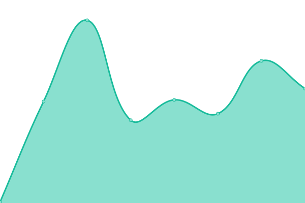
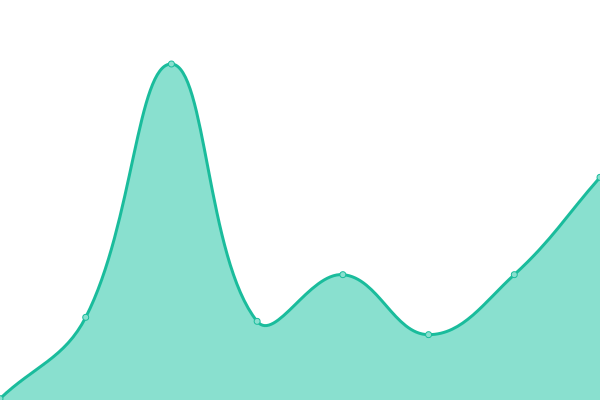
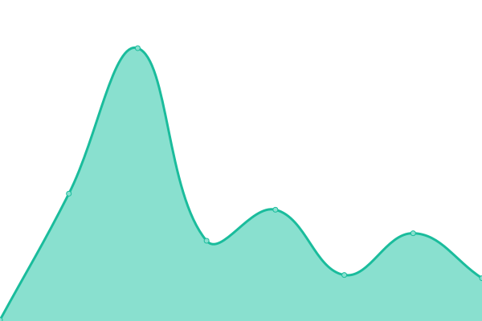

# [📈 Live Status](https://descent098.github.io/up): <!--live status--> **🟩 All systems operational**

This repository contains the open-source uptime monitor and status page for [Kieran Wood](kieranwood.ca), powered by [Upptime](https://github.com/upptime/upptime).

With [Upptime](https://upptime.js.org), you can get your own unlimited and free uptime monitor and status page, powered entirely by a GitHub repository. We use [Issues](https://github.com/descent098/up/issues) as incident reports, [Actions](https://github.com/descent098/up/actions) as uptime monitors, and [Pages](https://descent098.github.io/up) for the status page.

<!--start: status pages-->
<!-- This summary is generated by Upptime (https://github.com/upptime/upptime) -->
<!-- Do not edit this manually, your changes will be overwritten -->
<!-- prettier-ignore -->
| URL | Status | History | Response Time | Uptime |
| --- | ------ | ------- | ------------- | ------ |
|  [personal site](https://kieranwood.ca) | 🟩 Up | [personal-site.yml](https://github.com/Descent098/up/commits/HEAD/history/personal-site.yml) | 

 130ms
     
 | 

<a href="https://kieranwood.ca/history/personal-site">100.00%</a>
    

|  [Canadian Coding](https://canadiancoding.ca) | 🟩 Up | [canadian-coding.yml](https://github.com/Descent098/up/commits/HEAD/history/canadian-coding.yml) | 

 114ms
     
 | 

<a href="https://kieranwood.ca/history/canadian-coding">100.00%</a>
    

|  [ahd docs](https://ahd.readthedocs.io/en/latest/) | 🟩 Up | [ahd-docs.yml](https://github.com/Descent098/up/commits/HEAD/history/ahd-docs.yml) | 

 165ms
     
 | 

<a href="https://kieranwood.ca/history/ahd-docs">100.00%</a>
    

|  [ezcv docs](https://ezcv.readthedocs.io/en/latest/) | 🟩 Up | [ezcv-docs.yml](https://github.com/Descent098/up/commits/HEAD/history/ezcv-docs.yml) | 

 136ms
     
 | 

<a href="https://kieranwood.ca/history/ezcv-docs">100.00%</a>
    

|  [Philosophy Blog](https://kieranwood.ca/philosophy) | 🟩 Up | [philosophy-blog.yml](https://github.com/Descent098/up/commits/HEAD/history/philosophy-blog.yml) | 

 71ms
     
 | 

<a href="https://kieranwood.ca/history/philosophy-blog">100.00%</a>
    

|  [Tech blog](https://kieranwood.ca/tech) | 🟩 Up | [tech-blog.yml](https://github.com/Descent098/up/commits/HEAD/history/tech-blog.yml) | 

 75ms
     
 | 

<a href="https://kieranwood.ca/history/tech-blog">100.00%</a>
    

|  [Schulich Ignite](https://schulichignite.com) | 🟩 Up | [schulich-ignite.yml](https://github.com/Descent098/up/commits/HEAD/history/schulich-ignite.yml) | 

 129ms
     
 | 

<a href="https://kieranwood.ca/history/schulich-ignite">100.00%</a>
    

<!--end: status pages-->

[**Visit our status website →**](https://descent098.github.io/up)

## 📄 License

- Powered by: [Upptime](https://github.com/upptime/upptime)
- Code: [MIT](./LICENSE) © [Anand Chowdhary](https://anandchowdhary.com), supported by [Pabio](https://pabio.com)
- Data in the `./history` directory: [Open Database License](https://opendatacommons.org/licenses/odbl/1-0/)
